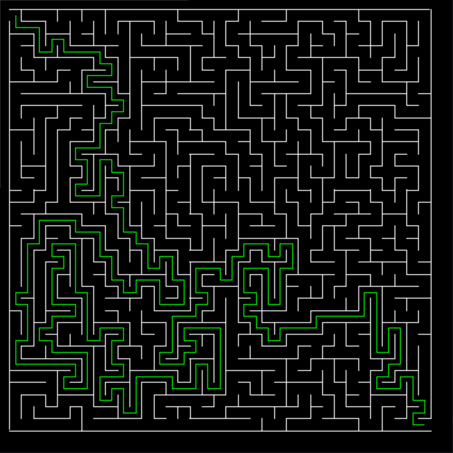

# Maze Generator and Solver

Can generate mazes up to 100 x 100 cells big, using a depth-first search algorithm. It can then solve the generated maze using a depth or breadth first search, and visualize the search.

Press R to clear the screen and generate a new maze. Press D to do a Depth First Search, or B to do a Breath First Search.

Uses the [graphics library](https://mcsp.wartburg.edu/zelle/python/graphics.py) by John Zelle to render graphics.

